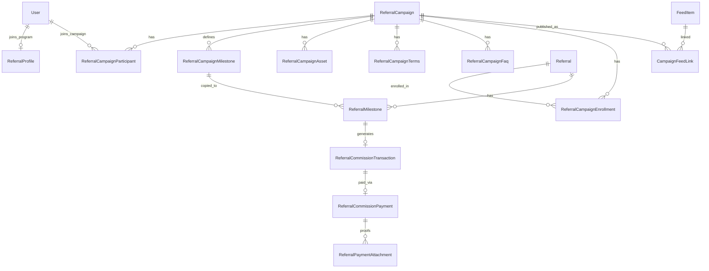

# Referral Campaign & Commission Management System

Additive upgrade on top of the existing Referral Program + Commission Engine. Existing referral APIs, CRM, auth, learning, certificates, and feed continue to work.

Full design doc covering schema, ER, APIs, workflows, migration, and backward compatibility.

---

## 1. Updated database schema

### Extended
- `referral_campaigns` — short title, campaign code, registration/referral windows, is_active, publish_as_feed, cloned_from_id, ARCHIVED status
- `referral_campaign_milestones` — per-milestone basis, due/expiry defaults, override/extension/auto-expire
- `referral_profiles` — `privacy_version`
- `referral_commission_transactions` — optional `referral_milestone_id`, `paid_at`
- Payment methods — `CHEQUE`, `OTHER`
- Triggers — `MANUAL_APPROVAL`

### New tables
| Table | Purpose |
|-------|---------|
| `referral_campaign_assets` | Banner, thumbnail, mobile, poster, story, email banner (URL-based media) |
| `referral_campaign_terms` | Versioned campaign T&Cs |
| `referral_campaign_faqs` | Configurable FAQs |
| `referral_participants` | User joins campaign + terms acceptance |
| `referral_campaign_enrollments` | Referral lead enrolled in a campaign |
| `referral_milestones` | Copied milestones per referral (status, due/expiry, extension) |
| `referral_payment_attachments` | JPG/PNG/PDF payment proofs |
| `campaign_feed_links` | Campaign ↔ FeedItem |
| `referral_campaign_audit_logs` | Campaign-level audit (old/new values, actor, IP optional) |

Migration: `prisma/migrations/20260725160000_referral_campaign_management/migration.sql`

---

## 2. ER diagram

---

## 3. APIs

### Existing (unchanged)
- `/api/v1/referrals*`, `/api/v1/referral-campaigns` CRUD, calculate/approve/pay/reports

### New
| Method | Path | Purpose |
|--------|------|---------|
| GET | `/api/v1/referral-campaigns/catalog` | Public + joined campaigns |
| GET/POST | `/api/v1/referral-campaigns/by-code/:code` | Detail + join campaign |
| POST | `/api/v1/referral-campaigns/:id/manage` | clone, status, asset, terms, faq, enroll, publish-feed |
| POST | `/api/v1/referral-milestones/:id` | achieve / extend milestone |
| POST | `/api/v1/referral-milestones/expire` | auto-expiry job |
| POST | `/api/v1/referral-commissions/payments/:id/attachments` | payment proof |

---

## 4. Admin screens
- `/admin/referral-commissions` — campaign hub
- `/admin/referral-commissions/campaigns/[id]` — builder + milestones + **clone / activate / archive / assets / terms / FAQs / publish feed**
- Approvals, payments, reports (existing)

## 5. User screens
- `/referral-campaigns` — active / joined campaigns
- `/referral-campaigns/[code]` — banner, timeline, courses, rewards, terms, FAQs, share links, join
- `/referrals` — existing leads + commission history

---

## 6–13. Workflows

**Campaign workflow:** Draft → configure milestones/assets/terms/FAQs → Activate → optional Publish as Feed → Pause/Archive

**Referral program workflow:** Accept general terms + privacy → code issued (unchanged)

**Campaign join:** Eligible partner accepts campaign terms → `referral_participants`

**Referral workflow:** Submit lead (existing) → Admin enrolls referral into campaign → milestones copied to `referral_milestones`

**Milestone workflow:** PENDING → ACHIEVED (trigger/basis) → creates commission txn → APPROVED → PAID

**Sequential unlock (customer-facing):** Only the first milestone in a campaign's sequence gets a due/expiry date and is
visible on enrollment (`unlocked_at` set). Later milestones are created locked (`unlocked_at = null`, no due/expiry date)
and hidden from `/referrals` progress view. When a milestone's commission transaction is approved (or paid directly),
`syncReferralMilestoneOnCommissionStatus` (in `campaign-management.service.ts`) marks that `referral_milestones` row
APPROVED/PAID and unlocks the next sequence for that referral + campaign, stamping a fresh due/expiry date starting
from the unlock moment. `achieveMilestone` rejects locked milestones ("Milestone is locked until the previous milestone
is approved").

**Expiry:** Default days from campaign milestone, counted from the moment a milestone unlocks (not from enrollment) →
per-referral override/extension → `POST …/expire` sets EXPIRED when due + autoExpire

**Payment:** Approve → pay (method includes Cheque/Other) → attach proof URLs → history on reports/payments

**Feed integration:** Manage action `publish-feed` creates INTERNAL_PROMOTION feed item + `campaign_feed_links`

**Audit:** Campaign actions → `referral_campaign_audit_logs`; commission actions → existing commission audit events

---

## 14. Reports
Existing commission reports remain. Campaign/expiry analytics available via enrollments + referral_milestones status filters (admin reports page + APIs).

---

## 15. Migration strategy
1. Deploy additive migration `20260725160000_referral_campaign_management`
2. Backfill `campaign_code` for existing campaigns
3. No drops of existing referral/commission columns
4. Run `npx prisma generate` after migrate
5. Optional: `POST /api/v1/referral-milestones/expire` on a schedule (cron / admin)

---

## 16. Backward compatibility
- Existing `/api/v1/referrals*` and commission calculate/pay flows unchanged
- Legacy QUALIFIED/REWARDED status on referrals still works
- CRM, Auth, Learning, Certificates, Feed modules not refactored
- New campaign features are parallel extensions

### Media note
Assets and payment proofs store **URLs** (Supabase Storage / CDN / external). No hardcoded reward amounts — all values come from campaign/milestone configuration.
